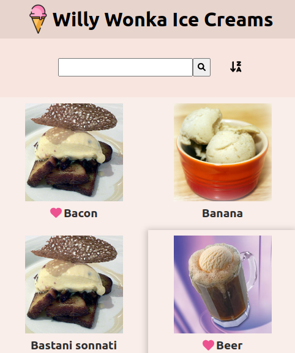

# Willy Wonka Challenge

🌎 **Website**: https://yosiris-m.github.io/WillyWonka_factory/

## ✅ Requirements 

This project is useful to show the Willy Wonka ice creams. The use cases are:
- Show ice cream list
- Show ice cream detail
- Filter ice cream by full-text search
- Change the ice cream list sort order
- Add ice cream to favorites
- Remove ice cream from favorites

The application has two screen:
- **Ice Cream List**: Shows a list with all ice creams. You can look for a specified ice cream using the filter component and change the sort oder.
- **Ice Cream Details**: Shows the ice cream details and add (or remove) to favorites.

To take into account:
- I am using the [local storage](https://developer.mozilla.org/es/docs/Web/API/Window/localStorage) to persist the favorites.
- I am filtering and sorting the list items using the JSON Server features:
  - [Full-text Search](https://github.com/typicode/json-server#full-text-search)
  - [Sort](https://github.com/typicode/json-server#sort)

## 🛠️ Build with
- [NodeJS](https://nodejs.org)
- [React](https://es.reactjs.org/)
- [React Router](https://reactrouter.com/)
- [CSS Modules](https://create-react-app.dev/docs/adding-a-css-modules-stylesheet)
- [Prettier](https://prettier.io)
- [Font Awesome](https://fontawesome.com/v5/docs/web/use-with/react/)
- [WebStorm](https://www.jetbrains.com/webstorm/)

### Available Scripts

In the project directory, you can run:

### `npm start`

Runs the app in the development mode.\
Open [http://localhost:3000/WillyWonka_factory](http://localhost:3000/WillyWonka_factory) to view it in the browser.

The page will reload if you make edits.\
You will also see any lint errors in the console.

### `npm run build`

Builds the app for production to the `build` folder.\
It correctly bundles React in production mode and optimizes the build for the best performance.

The build is minified and the filenames include the hashes.\
Your app is ready to be deployed!

See the section about [deployment](https://facebook.github.io/create-react-app/docs/deployment) for more information.

### `npm run deploy`

Builds the app for production and publishes everything from the `build` folder to the `gh-pages` branch.
